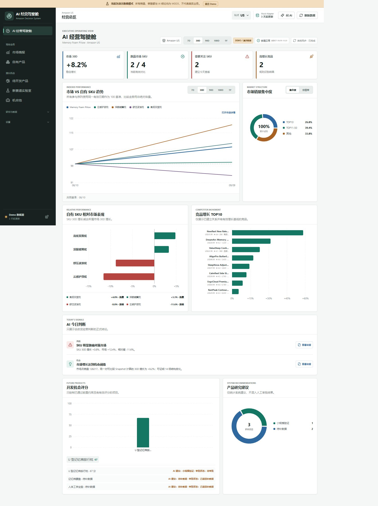
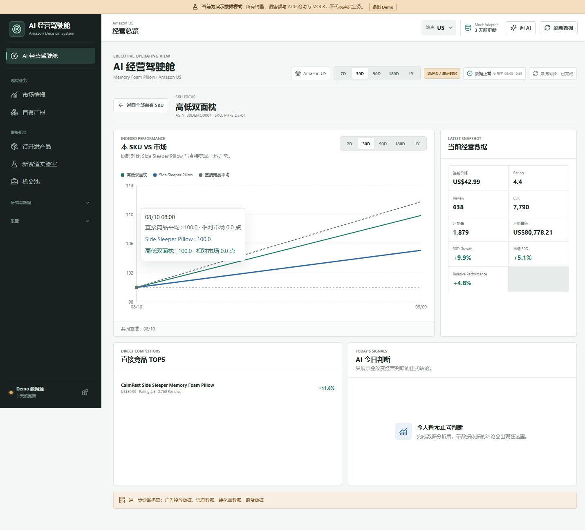
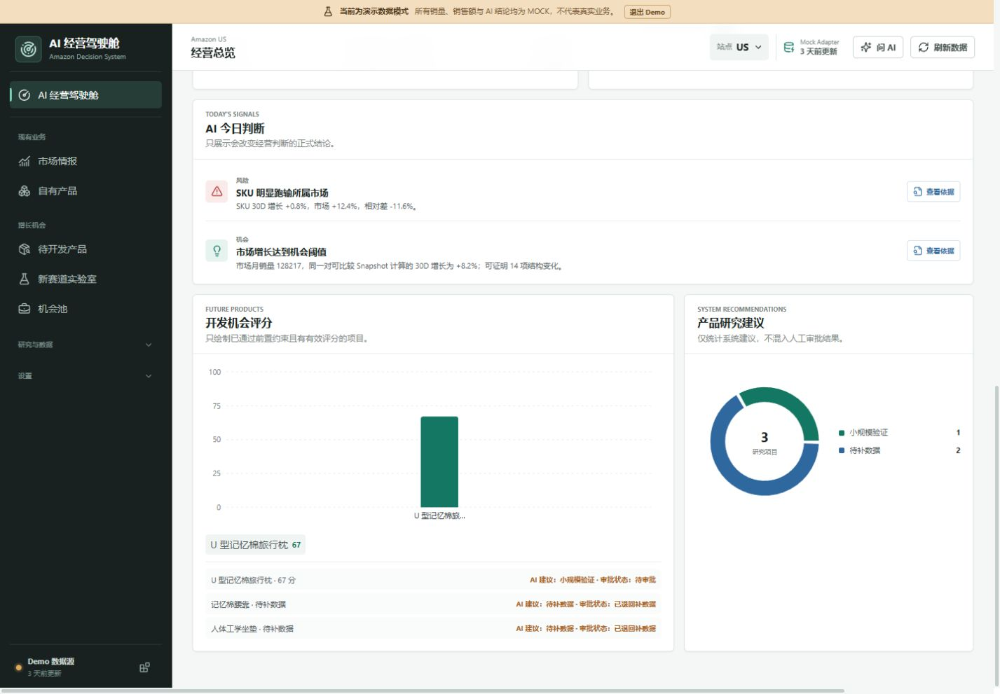
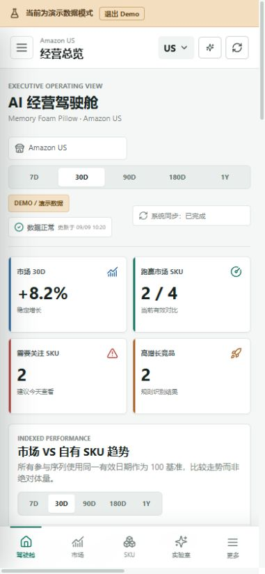

# Amazon AI Decision System V2.1.1 Correctness Patch

[](https://github.com/gonewiththesakura-creator/amazon-ai-decision-system/actions/workflows/ci.yml)

## 实现摘要

V2.1.1 不扩展老板驾驶舱的业务边界，只收口会误导决策的口径。首页现在把核心业务 Snapshot 新鲜度与系统任务同步状态分开；市场与 SKU 趋势使用同一基准日；系统建议与人工审批互不改写；Live 刷新必须通过显式 DataSourceRouter，不再偷偷回退 Mock。

## 修复前后

| 问题 | V2.1 | V2.1.1 |
| --- | --- | --- |
| 更新时间 | 最近 DataTask 可污染老板正在看的数据时间 | 按主市场、全部自有 SKU 和直接竞品的最新合法 Snapshot 计算，取必需实体中最旧采集时间 |
| 刷新失败 | 可被表述为整个业务数据失败 | 仅相关实体失败影响 Core Freshness，旧合法快照继续展示；系统同步单独呈现 |
| 趋势指数 | 每条曲线可各用自己首日作 100 | 只对具备共同正数基准日的序列比较，无法比较的序列显式排除 |
| 相对市场 | 前端可二次推导，指数差误标为百分比 | 服务端计算 `relativeToMarket`，前端以“点”展示指数差 |
| 建议与审批 | 审批 action 可回写或补造 recommendation | `systemRecommendation`、`approvalStatus`、`approvedAction` 分离，人工 watch/reject 不改写评分和系统建议 |
| 数据源 | Live 未指定 source 时存在隐式 Mock 路径 | Demo 才可路由 Mock；Live 只能选已配置真实 Adapter，不可用时明确失败 |
| 核心批量刷新 | 后续实体失败时可留下部分 Snapshot | 先抓取并校验全部对象，再在单事务中追加 Snapshot 和 Insight，失败时零部分写入 |
| 无主市场 | 可出现伪默认 `Memory Foam Pillow` | 显示“尚未设置主市场”和 Settings 入口，不选第一个 SKU 冒充市场 |
| SKU 数量 | 导航和状态假设永远是 4 | 页面文案和状态对任意非零 SKU 数量保持中性/正向 |

## 新增服务与契约

- `server/services/dashboard-freshness-service.ts`：计算 `CoreBusinessFreshness` 和独立的 `SystemSyncStatus`，识别相关任务失败、缺失实体、非法采集时间与超过 24 小时的核心采集时钟偏差。
- `server/adapters/adapter-registry.ts`：提供不可变 Adapter ID 到实例的注册表。
- `server/adapters/data-source-router.ts`：根据 task type、entity type、mode、marketplace 和显式 source preference 选择 Adapter。
- `DataTask.sourceId`：保留不受显示名变化影响的来源身份，retry 优先使用该 ID。
- `IndexedTrendComparisonMeta`：返回 `commonBaselineDate` 和 `excludedSeries`。
- `ExecutiveDevelopmentOpportunity`：新增 `scoreStatus`、`systemRecommendation`、`approvalStatus`、`approvedAction`。
- `CoreBusinessFreshness` / `SystemSyncStatus`：取代混合的单一 dashboard data status。

## 主要修改文件

- 后端聚合：`server/services/executive-dashboard-service.ts`、`server/services/dashboard-freshness-service.ts`
- 数据路由与刷新：`server/adapters/`、`server/services/intelligence-service.ts`、`server/repository/intelligence-repository.ts`
- API 与共享契约：`server/app.ts`、`shared/types.ts`
- 老板驾驶舱 UI：`src/pages/DashboardPage.tsx`、`src/components/dashboard/`、`src/components/AppShell.tsx`
- 无主市场和动态文案：`src/pages/SettingsPage.tsx`、`src/pages/OwnedProductsPage.tsx`、`src/components/Onboarding.tsx`
- CI：`.github/workflows/ci.yml`、Node.js 22 + `npm ci` + lint/typecheck/test/build

## 新增回归覆盖

- 无关任务不污染 Core Freshness；相关失败保留旧 Snapshot，实体新 Snapshot 可恢复状态。
- 主市场、自有 SKU、直接竞品的部分与全部恢复、非法 `collected_at`、stale 时钟。
- 错峰序列的共同基准、最大合法 cohort 降级、单点序列排除、SKU Focus 竞品平均降级。
- 审批不改写系统建议；即使存在合法 ApprovalRecord，缺失 Rule/Insight 建议时仍为 `needs_data`。
- Demo / Live 路由、Live 无 Mock fallback、核心批量中途失败零 Snapshot/Insight 写入。
- `keyword_refresh` / `review_refresh` 在持久化未实现前 fail-closed，不冒充市场或产品刷新成功。
- ASIN、marketplace、detail/snapshot ID、provenance、ISO 日期和数值分布校验。
- 无主市场、Demo 标识、动态 SKU 文案与窄屏建议/审批状态布局。

## 本地验证

2026-09-12 在 Node.js 22 环境通过：

```text
npm run lint       PASS
npm run typecheck  PASS
npm test           29 files / 217 tests PASS
npm run build      PASS (3056 modules)
npm run test:v2    16 files / 123 tests PASS
git diff --check   PASS
```

V2 专项集覆盖 migration、空数据、Demo 标识、两次 Snapshot 追加、`needs_data`、Hard Gate 拒绝、Evidence 引用、Reverse Review、Approval 和两个 V2 端到端任务。

## 实机截图









## 明确边界

- Freshness 按 V2.1.1 规范只把直接竞品作为核心依赖；竞品增长榜可展示其他关系类型，但它们不参与 Core Freshness。
- SellerSprite MCP 仍是明确 unavailable 的 Adapter stub；V2.1.1 没有伪称已连接真实数据。
- `owned_sku_refresh: all` 与 `competitor_refresh: all` 仍按实体事务执行；老板驾驶舱入口 `dashboard_core_refresh` 已保证全批次原子性。
- 关键词与评论的实时刷新会明确失败，等待 V2.2 对应持久化模型后再开放。
- 系统不自动采购、付款、判定专利安全或修改线上 Listing。
