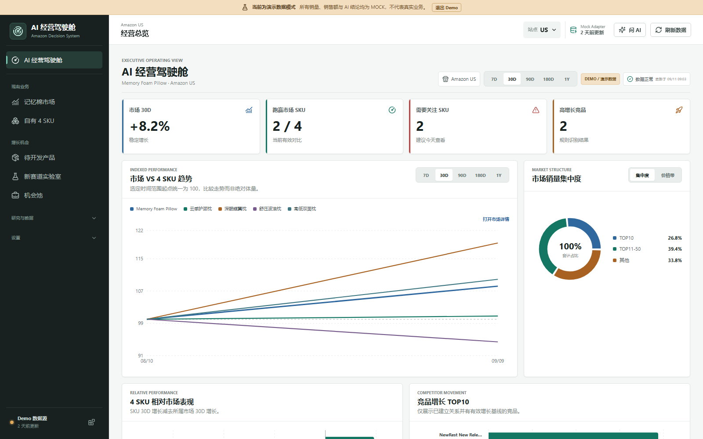
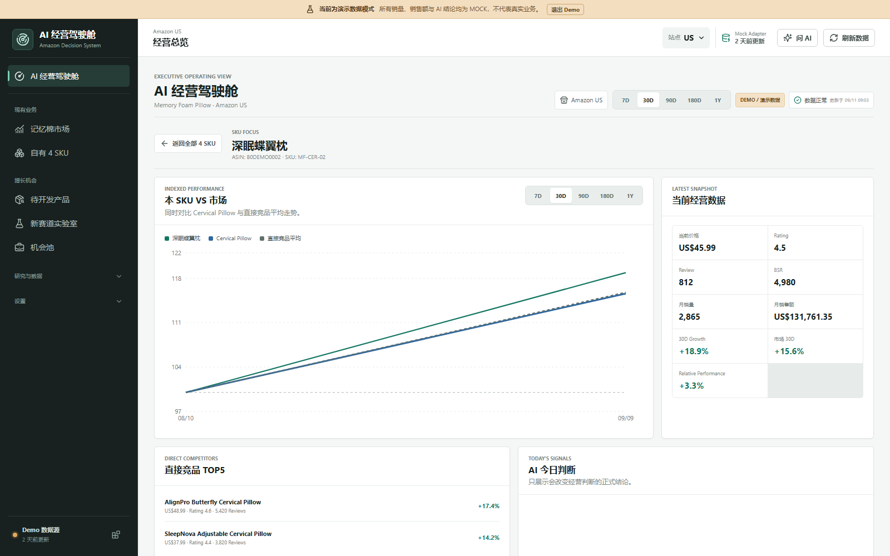
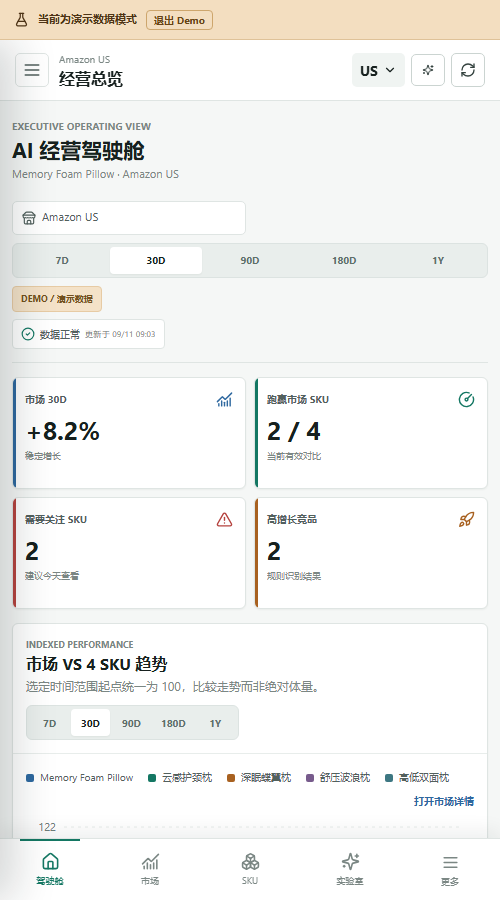

# Amazon AI Decision System V2.1 Implementation Summary

## 本轮目标

V2.1 将 V2 已有的可追溯研究工作流整理成日常可用的经营视图。首页不再只是摘要入口，而是围绕“市场是否变化、哪个 SKU 跑赢或跑输、哪些竞品异常、哪些开发项目可以继续”的 AI 经营驾驶舱。页面只组织和解释已有合法数据，不替代 Snapshot、确定性计算、Rule Engine、Evidence、Reverse Review 与人工 Approval。

## 已交付体验

### AI 经营驾驶舱

- 四项首屏 KPI：市场 30D、跑赢市场 SKU、需要关注 SKU、高增长竞品；无合法基线时显示未知状态，不补 `0`。
- 市场与 4 SKU 趋势统一指数化：选定范围内每条序列的首个有效正数观测为 `100`，用于比较走势而不是绝对销量。
- 市场集中度/价格带切换、4 SKU 相对市场表现、竞品增长 TOP10、开发机会评分和产品研究状态均优先图表呈现。
- AI 今日判断只收录会改变经营判断的当前正式 Insight；每条结论可打开 Evidence 和对应 ResearchJob。
- 数据新鲜度区分正常、部分未更新、数据不足和同步失败，并继续展示最近一份通过校验的合法快照。

### SKU Focus

- 从“4 SKU 相对市场表现”直接下钻，选中状态保存在 `?sku=<id>`，返回后不丢失时间范围。
- 同图对比本 SKU、所属市场和直接竞品平均；直接竞品平均只使用同日期、全部有合法值的样本。
- 汇总价格、Rating、Review、BSR、月销量、月销售额、SKU 30D、市场 30D 和 Relative Performance。
- 展示直接竞品 TOP5、当前正式 SKU Insight 及尚缺的广告、流量、转化、退货、历史快照或竞品组数据。

### 图表优先 MarketPage

- 页面顺序调整为：销量趋势 -> 销售额/平均价格趋势 -> 价格带/集中度 -> 细分机会排名 -> 明细与 AI 判断。
- `7D`、`30D`、`90D`、`180D`、`1Y` 只裁剪当前市场的合法历史快照；折线不跨越缺失值，少于两个有效点时显示明确空态。
- 细分机会只排列已有机会评分的 MarketNode；缺失评分不会作为零分参赛。
- TOP100 商品表最多展示接口返回的 100 条可核验商品，支持销量、30D 增长、价格和 Review 排序。

## 问 AI 与 Evidence Lineage

顶栏“问 AI”提供建议问题与自由输入。实体明确时，服务只读取当前 Marketplace、当前 dataVersion 的正式工作流 Insight；没有正式结论、问题匹配多个 SKU、指定 SKU 不存在，或证据只支持竞品组而不支持单品排名时，系统会说明限制，不把旧 Demo、无关实体或推测包装成答案。

经营结论的 Evidence 下钻包含：

- 支撑 claim 的指标与单位；
- 确定性计算方法；
- 来源、来源类型、采集时间、周期和估算标识；
- dataVersion、RuleProfile ID/版本和 Prompt 版本；
- 对应 ResearchJob 链接。

问 AI 的回答还显示正式/非正式状态；正式回答可打开原始 Evidence，查看 provenance、模型、dataVersion 与生成时间。

## 聚合 API

```http
GET /api/dashboard/executive?marketplace=US&range=30D
GET /api/dashboard/executive?marketplace=US&range=30D&skuId=<owned-product-id>
```

| 参数 | 约束 | 作用 |
| --- | --- | --- |
| `marketplace` | 可选，但提供时必须等于当前工作区 | 防止跨 Marketplace 读取 |
| `range` | `7D`、`30D`、`90D`、`180D`、`1Y`，默认 `30D` | 裁剪并指数化趋势 |
| `skuId` | 可选，必须是当前 Marketplace 的自有 SKU | 返回 `skuFocus` 下钻数据 |

响应聚合 KPI、趋势、结构分布、SKU 相对表现、竞品增长、正式结论、开发机会、研究状态、数据状态和可选 `skuFocus`。它是只读 ViewModel，不写 Snapshot、不执行评分，也不生成 AI 结论。

## 响应式与无障碍

- 桌面使用持久侧栏和多列经营网格；窄屏切换为可关闭的导航对话框、单列内容和固定底部快捷导航。
- 时间范围、市场结构和排序使用可读的分段控制或原生选择框；当前状态通过 `aria-pressed`、`aria-expanded` 等语义暴露。
- 移动导航、问 AI 和 Evidence 抽屉支持焦点约束、`Escape` 关闭、关闭后焦点恢复及背景滚动锁定。
- 装饰图标对辅助技术隐藏；错误、数据不足、同步状态和异步回答使用合适的 alert/status/live 语义。
- 驾驶舱关键 Recharts 图表提供屏幕阅读器可读的数据表或文本明细；全局保留 `focus-visible`，并为减少动画偏好关闭非必要过渡。

## 核心文件

- `server/services/executive-dashboard-service.ts`：只读驾驶舱聚合、指数化、正式结论与数据状态规则。
- `server/app.ts`、`shared/types.ts`：聚合 API 路由、参数校验与前后端 ViewModel 契约。
- `src/pages/DashboardPage.tsx`、`src/components/dashboard/`：经营驾驶舱、SKU Focus、图表、空态及 Evidence 详情。
- `src/components/ExecutiveAiDrawer.tsx`：顶栏经营问答与正式结论限制。
- `src/pages/MarketPage.tsx`：图表优先市场页、TOP100 排序与明确的新品字段缺口。
- `src/pages/OwnedProductsPage.tsx`：从 SKU Focus 到指定竞品的筛选、滚动与焦点定位。
- `src/components/AppShell.tsx`：简化导航、移动端导航对话框和全局问 AI 入口。
- `server/executive-dashboard.test.ts`、`src/components/dashboard/dashboard.test.tsx`、`src/pages/OwnedProductsPage.test.tsx`：聚合边界、图表数据等价内容和下钻交互回归测试。

## 截图







## 明确未完成

- 当前商品数据缺少可信的上架日期或首次观测日期，因此 TOP100 的“新品”排序已禁用。系统不会用 Review 数、销量、标签或其他代理变量推断新品身份。
- SellerSprite MCP 仍是显式 unavailable 的 Adapter stub，尚无真实账号、鉴权与正式 schema。
- 外部 LLM 尚未接入；当前解释由 `rule-engine-v1` 可复现生成，确定性指标不交给 AI 重算。
- 常驻 worker/scheduler 尚未启用，监控与 DataTask 仍由用户手动运行或重试。
- Admin/Viewer 只是本地权限预览，不是企业身份认证或多租户授权。
- 广告、退货、库存、真实成本、供应商、合规和专业 IP 数据源尚未接入。
- 系统不自动采购、付款、判断专利安全或修改线上 Listing。

## 验收结果

2026-09-11 在 Node.js 22 环境执行：

```powershell
npm run lint
npm run typecheck
npm test
npm run build
```

- ESLint：通过，无 warning/error。
- TypeScript：通过。
- Vitest 全量：27 个测试文件、185 项测试全部通过。
- Vite 生产构建：通过，3,056 个模块完成转换。

V2 两个主验收任务仍可单独运行：

```powershell
npm run test:v2
```

该验收集为 16 个测试文件、123 项测试，已全部通过；覆盖 migration、空数据与 Demo 标识、两次 Snapshot 追加、`needs_data`、Hard Gate 拒绝、Evidence 引用、Reverse Review、Approval 和两个 V2 端到端任务。
